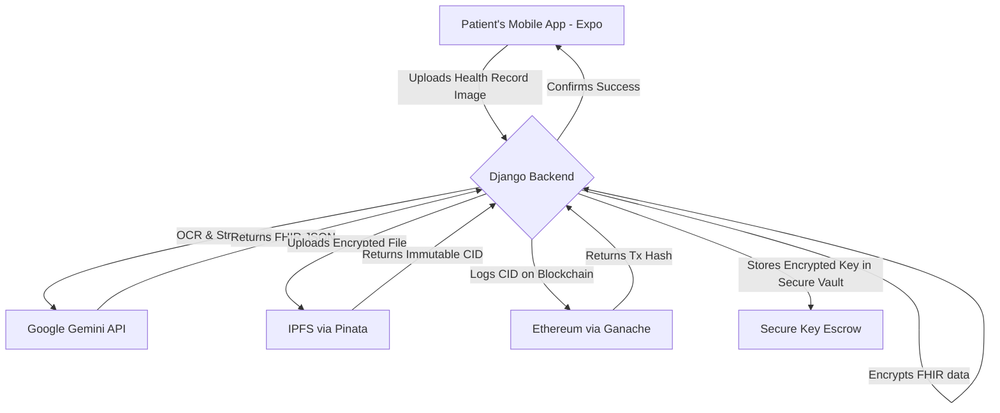
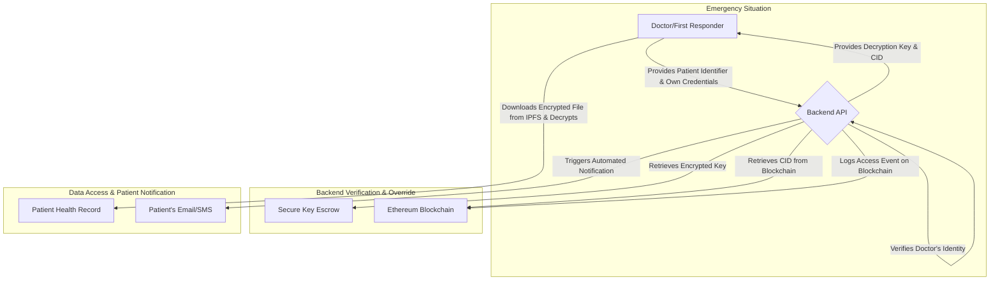

# 🏥 MEDITRUST (Break-the-Glass Protocol)

This project is a full-stack, decentralized application designed to solve a critical problem in emergency medicine: providing first responders and doctors with immediate, life-saving access to a patient's vital health information, while maintaining patient privacy and control under normal circumstances.

---

## 🎯 Project Vision: The "Break-the-Glass" Scenario

In a critical emergency, a patient may be incapacitated and unable to grant consent. First responders and doctors often lack access to vital information like blood type, allergies, or pre-existing conditions, leading to dangerous delays or medical errors.

This system addresses this by implementing a "Break-the-Glass" protocol:

- 🔐 **Normal State**: The patient's data is fully encrypted and under their control. No one can access it.
- 🚨 **Emergency State**: A verified healthcare provider can trigger an emergency override to access the encrypted data.
- 📩 **Patient Acknowledgement**: The moment the data is accessed, an automated, immutable notification is logged, and the patient is alerted, ensuring transparency and accountability.

---

## 🛠️ System Architecture & Workflow

The system operates in two distinct phases:

### 📦 Phase 1: Secure Data Onboarding (Patient-Controlled)

This is the standard process where a patient uploads their information.

### 🚑 Phase 2: Emergency Data Access (Doctor Override)

This is the "Break-the-Glass" protocol in action.

---

## 🧠 Core Technologies & Their Roles

- **Frontend (Expo)**: The patient's interface for uploading and managing their health data.
- **Backend (Django)**: The central orchestrator for the entire workflow, managing API requests, encryption, and communication between services.
- **Google Gemini API**: Acts as an intelligent medical data parser, converting unstructured image text into a standardized FHIR format, crucial for interoperability.
- **IPFS (via Pinata)**: Stores the encrypted health record. Its content-addressable nature ensures the data file cannot be tampered with.
- **Ethereum (via Ganache)**: Serves as an immutable audit log. It logs:
  - The initial creation of a record (CID).
  - Every "break-the-glass" access event, creating a permanent, non-repudiable record of who accessed the data and when.
- **AES Encryption**: Ensures data on the public IPFS network is unreadable without the specific decryption key.
- **Secure Key Escrow (Conceptual)**: A critical backend component (e.g., HashiCorp Vault, AWS KMS) that securely holds decryption keys, releasing them only upon authorized emergency overrides.

---

## 📋 Data Standards & Compliance in an Emergency Context

This architecture is designed with HIPAA (US), GDPR (EU), and DPDPA (India) in mind, especially regarding emergency access.

### 📄 FHIR / HL7

By structuring data as a FHIR Patient Resource, we ensure it is immediately usable and interoperable with hospital EHR systems once decrypted—saving precious time.

### ⚖️ HIPAA, GDPR, & DPDPA Compliance

> **Disclaimer**: This is a proof-of-concept. Achieving full compliance requires rigorous legal and security audits.

Our architecture aligns with key principles for emergency data access:

- **Legal Basis for Processing (GDPR/DPDPA)**: In an emergency where the patient cannot consent, data processing is permissible to protect the "vital interests" of the individual.
- **Emergency Access (HIPAA)**: HIPAA allows healthcare providers to access necessary information for treatment in emergencies.
- **Accountability and Transparency**:
  - The system immediately notifies the patient or their contact and logs the access on the blockchain.
  - This provides a clear audit trail and prevents misuse of the override.
- **Data Minimization**: The Gemini prompt is engineered to extract only essential medical information—no extraneous data is collected.

---

## ⚙️ Setup and Installation

> python manage.py makemigrations
> python manage.py migrate
> python manage.py runserver

---

## 🔮 Future Development & Next Steps

To make this concept production-ready, the following components need to be developed:

- 🏥 **Healthcare Provider Portal**: A secure web interface for hospitals and doctors to register and initiate override requests.
- 🆔 **Identity Verification System**: Integrate with trusted providers for healthcare identity validation.
- 📡 **Patient Notification Service**: Use services like Twilio (SMS) or SendGrid (Email) for real-time alerts.
- 🔑 **Secure Key Escrow**: Production-grade secrets management via Vault, AWS KMS, etc.
- 👥 **Role-Based Access Control (RBAC)**: Define specific roles and permissions for patients, doctors, and paramedics.

---
